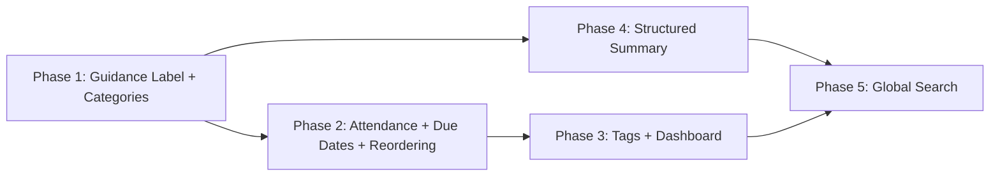

# MeetingBot Enhancement Plan (Phased)

## Current State

- **Schema**: `[schema.ts](src/server/src/server/db/schema.ts)` - `bots`, `actionItems`, `agendaItems`, `meetingAttendees`, `attendees`
- **API routers**: `[routers/](src/server/src/server/api/routers/)` - tRPC endpoints
- **Frontend**: `[app/](src/server/src/app/)` - Next.js 15 App Router, shadcn/ui
- **PDF export**: `[exportAgendaPdf.ts](src/server/src/lib/exportAgendaPdf.ts)` - currently labels "Sadhguru Comments"

---

## Phase 1: Quick Wins (Label + Categories)

*Estimated effort: small. No complex UI changes. Low risk.*

### 1A. "Sadhguru Comments" to "Guidance" Relabeling

Display-only change. DB column `sadhguru_comments` stays as-is.

**Files to update** (string replacement):

- `[AgendaItemDetailModal.tsx](src/server/src/app/meetings/components/AgendaItemDetailModal.tsx)`: label, placeholder, icon tooltip
- `[exportAgendaPdf.ts](src/server/src/lib/exportAgendaPdf.ts)`: column header + comments in code
- `[MeetingAgendaItems.tsx](src/server/src/app/meetings/components/MeetingAgendaItems.tsx)`: if any label references exist
- Run a codebase-wide grep for "Sadhguru" to catch any others

### 1B. Category Fields on Action Items + Agenda Items

**Schema** in `[schema.ts](src/server/src/server/db/schema.ts)`:

- Add `category` varchar(50) nullable to `action_items` table
- Add `category` varchar(50) nullable to `agenda_items` table
- Predefined values: `"Policy"`, `"Budget Approval"`, `"Follow-up"`, `"General"`
- Update Zod insert/update schemas for both

**API**:

- `[actionItems.ts](src/server/src/server/api/routers/actionItems.ts)`: accept `category` in create/update, add `category` filter to `getAllActionItems`
- `[agendaItems.ts](src/server/src/server/api/routers/agendaItems.ts)`: accept `category` in create/update, add `category` filter to `getAll`

**Frontend**:

- `[ActionItemsList.tsx](src/server/src/app/meetings/components/ActionItemsList.tsx)`: category selector per item
- `[action-items/page.tsx](src/server/src/app/action-items/page.tsx)`: category filter dropdown
- `[AgendaItemDetailModal.tsx](src/server/src/app/meetings/components/AgendaItemDetailModal.tsx)`: category field
- `[agenda-items/page.tsx](src/server/src/app/agenda-items/page.tsx)`: category filter dropdown
- `[MeetingAgendaItems.tsx](src/server/src/app/meetings/components/MeetingAgendaItems.tsx)`: category badge display

**Migration**: `pnpm db:generate && pnpm db:migrate`

### Phase 1 Manual Testing Checklist

- Open any agenda item detail modal -- confirm label reads "Guidance" (not "Sadhguru Comments")
- Export agenda to PDF -- confirm column header reads "Guidance"
- Create a new action item -- verify category dropdown appears with options (Policy, Budget Approval, Follow-up, General)
- Edit an existing action item -- change category, reload page, confirm it persists
- On `/action-items` page, filter by category -- verify only matching items show
- Create/edit an agenda item -- verify category field appears and persists
- On `/agenda-items` page, filter by category -- verify filtering works
- Existing items with no category should display gracefully (no errors)

---

## Phase 2: Attendance, Due Dates, Drag-and-Drop Ordering

*Estimated effort: medium. Schema + API + UI for three distinct features.*

### 2A. Attendance Mode (In-Person / Virtual / Absent)

**Schema** in `[schema.ts](src/server/src/server/db/schema.ts)`:

- Add `attendanceMode` varchar(20) nullable to `meeting_attendees` table (values: `"in-person"` | `"virtual"` | `"absent"`)
- Add `updateMeetingAttendeeSchema` Zod schema

**API** in `[meetingAttendees.ts](src/server/src/server/api/routers/meetingAttendees.ts)`:

- Add `updateAttendanceMode` mutation: `{ botId, attendeeId, attendanceMode }`
- Update `getByMeeting` to return `attendanceMode`

**Frontend** in `[MeetingAttendees.tsx](src/server/src/app/meetings/components/MeetingAttendees.tsx)`:

- When meeting status is `DONE` or `CALL_ENDED`, show per-attendee mode selector (dropdown: In-Person / Virtual / Absent)
- Visual indicators: icons (building for in-person, monitor for virtual, x-circle for absent)
- Only GC role can mark

### 2B. Action Item Due Date Editing

Due date field already exists in schema. Changes are UI-only:

- `[ActionItemsList.tsx](src/server/src/app/meetings/components/ActionItemsList.tsx)`: add inline date picker (shadcn DatePicker/Popover+Calendar)
- `[action-items/page.tsx](src/server/src/app/action-items/page.tsx)`: add inline date picker, add sort-by-due-date option

### 2C. Drag-and-Drop Reordering (Action Items AND Agenda Items)

**Schema** in `[schema.ts](src/server/src/server/db/schema.ts)`:

- Add `sortOrder` integer to `action_items` table (default 0; backfill based on `id`)
- Agenda items already have `serialNum` for ordering

**API**:

- `[actionItems.ts](src/server/src/server/api/routers/actionItems.ts)`: add `reorder` mutation (`botId` + array of `{id, sortOrder}`), update `getActionItems` to `ORDER BY sortOrder`
- `[agendaItems.ts](src/server/src/server/api/routers/agendaItems.ts)`: add `reorder` mutation (`botId` + array of `{id, serialNum}`), ensure `getByMeeting` orders by `serialNum`

**Frontend** (both use `@hello-pangea/dnd`, already a project dependency):

- `[ActionItemsList.tsx](src/server/src/app/meetings/components/ActionItemsList.tsx)`: wrap list in `DragDropContext` + `Droppable` + `Draggable`, add `GripVertical` handles, call `reorder` on drop
- `[MeetingAgendaItems.tsx](src/server/src/app/meetings/components/MeetingAgendaItems.tsx)`: wrap agenda item list in `DragDropContext`, add grip handles, call `reorder` on drop (update `serialNum` values)

**Migration**: `pnpm db:generate && pnpm db:migrate`

### Phase 2 Manual Testing Checklist

- Open a completed meeting -- attendee list shows mode selector (In-Person / Virtual / Absent)
- Mark attendees with different modes -- reload page, verify persistence
- Open a scheduled (not-yet-done) meeting -- attendance mode selector should NOT appear
- On per-meeting action items, click due date area -- date picker opens, select a date, verify it saves
- On `/action-items` page, sort by due date -- verify ordering is correct
- On per-meeting action items, drag an item up/down -- verify order changes and persists after reload
- On per-meeting agenda items, drag an item up/down -- verify `serialNum` reorders and persists after reload
- Add a new action item -- verify it appears at the end of the list with correct sortOrder
- Add a new agenda item -- verify serialNum is correctly assigned

---

## Phase 3: Tags + Pending Actions Dashboard

*Estimated effort: medium-high. New tables, junction table, tag management UI.*

### 3A. Predefined Tags on Action Items

**Schema** in `[schema.ts](src/server/src/server/db/schema.ts)`:

- New `action_item_tags` table: `id` serial PK, `name` varchar unique, `color` varchar, `createdAt`
- New `action_item_tag_assignments` junction: `id`, `actionItemId` FK, `tagId` FK
- Zod schemas for both

**API** in `[actionItems.ts](src/server/src/server/api/routers/actionItems.ts)`:

- `getTags` / `createTag` / `deleteTag` -- manage the predefined tag list
- `addTagToItem` / `removeTagFromItem` -- assign/unassign tags
- Update `getActionItems` / `getAllActionItems` to join tags and return them
- Add optional `tagIds` filter to `getAllActionItems`

**Frontend**:

- `[ActionItemsList.tsx](src/server/src/app/meetings/components/ActionItemsList.tsx)`: tag badges on each item, multi-select popover to assign tags
- `[action-items/page.tsx](src/server/src/app/action-items/page.tsx)`: tag filter dropdown in filters bar
- Tag management section (small modal or settings area for GC to create/delete predefined tags)

### 3B. Pending Actions Dashboard Enhancement

Enhance `[action-items/page.tsx](src/server/src/app/action-items/page.tsx)`:

- Default filter to "Open" status instead of "All"
- Summary stats cards at top: Total Open, Overdue (past due date), Due This Week, Completed
- Sort options dropdown: by due date, by priority, by meeting date, by creation date
- Group-by toggle: by meeting (current default), by assignee, by tag

**Migration**: `pnpm db:generate && pnpm db:migrate`

### Phase 3 Manual Testing Checklist

- Navigate to tag management -- create tags "Global Budget Policy", "Followup", "Approval" with different colors
- On a meeting's action items, assign a tag to an item -- verify badge appears
- Assign multiple tags to one item -- verify all badges show
- Remove a tag from an item -- verify it disappears
- On `/action-items` page, filter by a tag -- verify only tagged items show
- Delete a predefined tag -- verify it's removed from all assigned items
- On `/action-items` page, verify stats cards show correct counts (Open, Overdue, Due This Week, Completed)
- Change sort option to "by due date" -- verify order changes correctly
- Switch group-by to "by assignee" -- verify items regroup correctly
- Default status filter should be "Open" on page load

---

## Phase 4: Structured Meeting Summary

*Estimated effort: medium. Prompt engineering + new DB fields + tabbed UI.*

### 4A. Separate Summary Sections

**Schema** in `[schema.ts](src/server/src/server/db/schema.ts)`:

- Add to `bots` table: `summaryMinutes` text, `summaryActionItems` text, `summaryDecisions` text, `summaryOverview` text
- Keep legacy `summary` field for backward compatibility

**API** in `[bots.ts](src/server/src/server/api/routers/bots.ts)`:

- Update `generateSummary` Gemini prompt to return structured JSON with keys: `minutes`, `actionItems`, `decisions`, `summary`
- Use `responseMimeType: "application/json"` for reliable parsing
- Parse response and save each section to its DB field
- Save concatenated version to legacy `summary` field
- Update `getSummary` to return all four fields

**Frontend** in `[TranscriptViewer.tsx](src/server/src/app/meetings/components/TranscriptViewer.tsx)`:

- Replace single summary card with shadcn `Tabs`:
  - "Summary" tab (overview)
  - "Minutes" tab (detailed meeting minutes)
  - "Action Items" tab (AI-extracted action items from summary)
  - "Decisions" tab
- Fallback: if structured fields are null but legacy `summary` exists, render it as-is (backward compat)

**Migration**: `pnpm db:generate && pnpm db:migrate`

### Phase 4 Manual Testing Checklist

- Open a meeting with an existing transcript -- click "Generate Summary"
- Verify the summary card now shows 4 tabs: Summary, Minutes, Action Items, Decisions
- Click each tab -- verify content appears and is meaningful
- Reload the page -- verify saved sections load correctly in tabs
- Open an older meeting that had a legacy summary -- verify it still displays (backward compat)
- Generate summary on a new meeting -- verify all 4 DB fields are populated (check via Drizzle Studio)

---

## Phase 5: Global Full-Text Search

*Estimated effort: high. PostgreSQL indexing + new router + new UI page. Depends on all prior phases.*

### 5A. PostgreSQL Full-Text Search Infrastructure

**Migration** (hand-written SQL or Drizzle custom migration):

- Add `tsvector` generated columns on:
  - `bots`: from `meeting_title || transcription || summary || summary_minutes || summary_decisions || summary_overview`
  - `action_items`: from `content || assignee`
  - `agenda_items`: from `description || discussion_summary || decision_resolution || sadhguru_comments`
- Create GIN indexes on each `tsvector` column

### 5B. Search API

- Create new `[search.ts](src/server/src/server/api/routers/search.ts)` router
- `globalSearch` endpoint: `query` string, optional `type` filter (meetings / actionItems / agendaItems)
- Uses `to_tsquery` + `ts_rank` for ranked results
- Returns unified results: `{ type, id, title, snippet, meetingId, rank }`
- Register in `[root.ts](src/server/src/server/api/root.ts)`

### 5C. Search UI

- Add search bar to `[NavigationBar.tsx](src/server/src/components/NavigationBar.tsx)` (command+K shortcut style) or create `/search` page
- Search results with tabs: All, Meetings, Action Items, Agenda Items
- Each result links to the relevant meeting detail page or item

### Phase 5 Manual Testing Checklist

- Type a keyword that appears in a meeting transcript -- verify meeting appears in results
- Search for an action item content -- verify it appears with correct meeting link
- Search for an agenda item description -- verify it appears
- Filter search by type "Meetings" -- verify only meetings show
- Search for a non-existent term -- verify empty state displays
- Verify search ranking: exact matches rank higher than partial
- Test with special characters in search query -- no errors
- Performance: search across 50+ meetings should return in < 1 second

---

## Dependency Graph

Phases 1-3 are sequential (each builds incrementally on schema). Phase 4 can start after Phase 1. Phase 5 depends on both Phase 3 (tags) and Phase 4 (summary fields) because the search indexes need to cover all final fields.

---

## Files Changed Per Phase

- **Phase 1** (5 files): `schema.ts`, `actionItems.ts`, `agendaItems.ts`, `AgendaItemDetailModal.tsx`, `exportAgendaPdf.ts`, `ActionItemsList.tsx`, `action-items/page.tsx`, `agenda-items/page.tsx`, `MeetingAgendaItems.tsx`
- **Phase 2** (6 files): `schema.ts`, `meetingAttendees.ts`, `actionItems.ts`, `agendaItems.ts`, `MeetingAttendees.tsx`, `ActionItemsList.tsx`, `MeetingAgendaItems.tsx`, `action-items/page.tsx`
- **Phase 3** (4 files): `schema.ts`, `actionItems.ts`, `ActionItemsList.tsx`, `action-items/page.tsx`
- **Phase 4** (3 files): `schema.ts`, `bots.ts`, `TranscriptViewer.tsx`
- **Phase 5** (3 new + 2 modified): `search.ts` (new), `root.ts`, `NavigationBar.tsx`, + migration SQL

